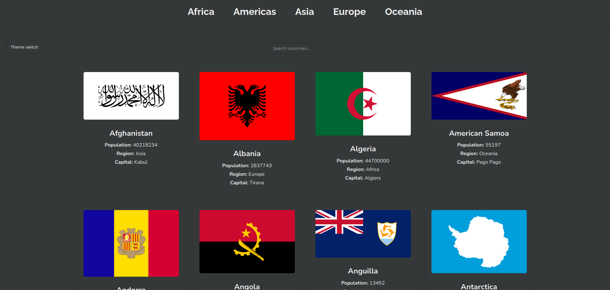

# Countries Website with REST API



Этот проект представляет собой веб-приложение для просмотра информации о различных странах мира с использованием REST API. Вы можете фильтровать страны по регионам, выполнять поиск, а также переключать тему сайта.
Описание

Это веб-приложение разработано с использованием HTML, CSS и JavaScript. Оно использует REST API для получения данных о странах, включая название, флаг, столицу, население и другие важные данные. Пользователи могут также переключать тему сайта между светлой и темной.
Функциональность

  - Фильтрация по регионам: Вы можете фильтровать страны по регионам, таким как Африка, Америка, Азия, Европа и Океания.

  - Поиск стран: Есть возможность выполнения поиска стран по их названию.

  - Переключение темы: Вы можете изменять тему сайта между светлой и темной, нажимая на кнопку "Theme switch" в верхнем правом углу.

  - Пагинация: Для удобства навигации по большому списку стран, предусмотрена пагинация с кнопками "prev" и "next" и отображением текущей страницы.


## Структура проекта

  - index.html: Главная страница веб-приложения.
  - style.css: Файл со стилями для внешнего вида сайта.
  - script.js: JavaScript код для обработки событий и взаимодействия с данными о странах через REST API.


## Как использовать

  Клонируйте репозиторий на свой локальный компьютер:

  ```bash

  git clone git@github.com:myrzakan/Countries.git

  ``````

  Откройте файл index.html в вашем веб-браузере для просмотра и использования веб-приложения.

Использование REST API

